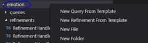
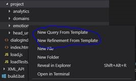
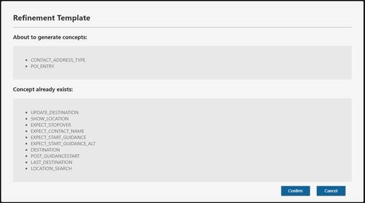
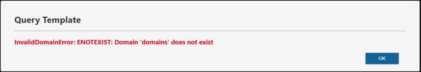
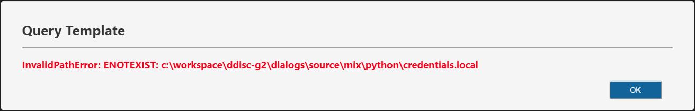

# Refinement/Query Code Template Tool
## Usage
### Explorer/Context Menu

* `Right-Click on a folder name that represents a domain`

### Commands

* `New Query From Template`

    To generate query templates from current selected domain folder.

* `New Refinement From Template`

    To generate refinement templates from current selected domain folder.
## Query/Refinement List WebView

### About to generate concepts
* `This is a list of Queries/Refinements to be generated`
### Concept already exists
* `This is a list of Queryies/Refinements already exists`
## Error Report
### Not A Valid Domain
* `When you Right-Click on a folder which is not a valid domain, this error will show up.`

### File Not Exists
* `When the dependent credentials.local file does not exist, this error will show up.`

* `When the id.txt file for the domain is not yet created, this error will show up.`

